# 缠论基础——01 K线与分型

## 一、传统K线与缠论K线的区别

传统理论中对K线的理解与缠论中对K线的理解有本质区别。

**传统K线：常用阴线、阳线幅度，以及上、下影线进行多空强弱的分析**。

传统K线理论是直接用阴阳K线进行分析的。以K线、K线组合、K线结构、K线形态，以及K线之间的关系为基础的各种理论，都是通过K线之间量价时空的关系来进行相对的多空强弱分析，如图所示。

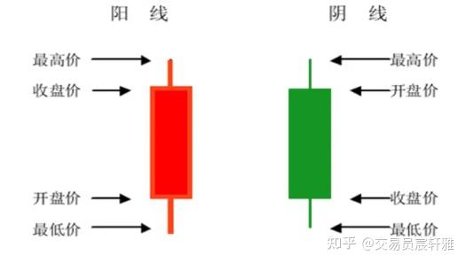

传统K线

传统理论中的K线具备独立的市场含义，可直接进行多空强弱分析。

**缠论K线：只取一根K线的高低点去跟相邻的K线进行对比考察**。

传统K线中有四个价位：开盘价、收盘价、最高价、最低价。缠论K线中只有两个价位：最高价和最低价。缠论K线只有一个K线实体，没有上影线、下影线以及阴阳线的区别，如图所示：

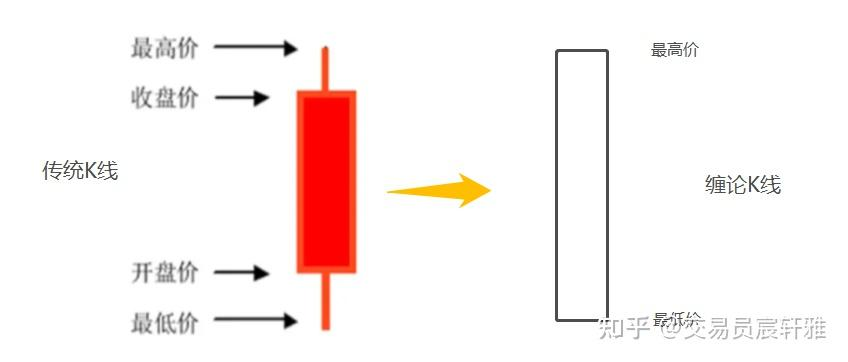

传统K线和缠论K线

缠论：最小分析单位是笔而不是K线，K线只是作为笔的组件。缠论是用一个完全独特的视角在分析市场，它的分析基础已经不是K线，而是笔。K线只是笔的组成部分，没有任何市场含义，缠论中的K线是不能用来做多空强弱分析的，如图所示。

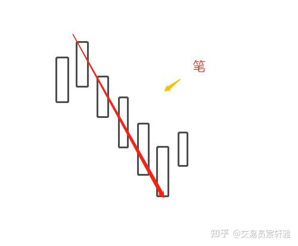

笔

缠论中K线只是笔的组件，就像汉子"张"的拼音是"zhang"，"a"是代表不了"zhang"的，必须从整体去看，它才有分析意义。也就是说要从传统理论中跳出来，不能用阴阳线的多空意义去套用缠论中的K线，缠论中的K线要从缠师所定义的角度来进行理解。

其实任何一个体系都应该从它独特的角度给出唯一的或者确定的结果，再去综合分析。我们在量化过程中，就是在每个单因子测完，输出了各自的结果之后，再去考虑综合性的拟合。

## 二、K线的四种分型

根据相邻的三根K线的形态特征，可以对K线进行归类，分成四种形态：上升K线序列、下降k线序列、顶分型、底分型，如图所示。

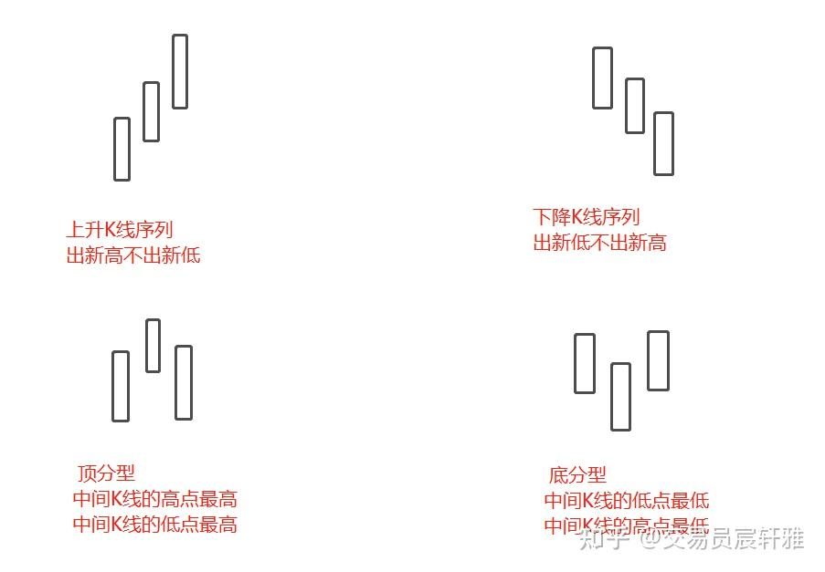

K线的四种分型

1、上升K线序列
三根K线是逐次出新高不出新低的，每一根K线是逐渐往上运行的。

2、下降K线序列
三根K线是逐次出新低不出新高的，每一根K线是逐渐往下运行的。

3、顶分型
中间K线的高点最高，中间K线的低点最高，就像一个"品"字。

4、底分型
中间K线的低点最低，中间K线的高点最低，就像一个倒"品"字。

在K线运动过程中，K线间的关系并不都是规则的，这时还需要进行K线包含关系的处理工作，但处理后必然是这四种分型中的其中一种。

## 三、相邻两根K线的包含关系

相邻的两根K线，一根K线的高低点全部包含在另一根K线的高低点范围内，这两根K线就形成了包含关系，否则为非包含关系，如图所示。

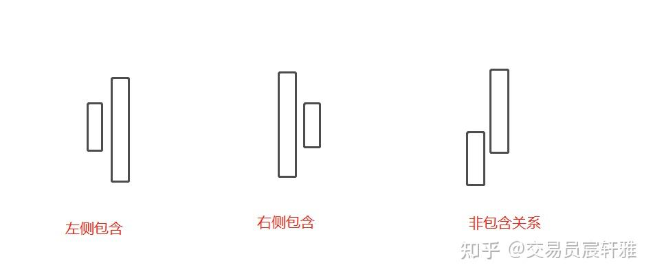

包含关系

## 四、包含关系的处理

### 1、先找到处理方向

包含关系的处理有两种：向上处理和向下处理。处理前提是先找到前面的非包含关系的K线，确定处理方向。

（1）向上处理
向上处理一定是存在包含关系的K线处于一个向上序列中，即前面要有跟K线是非包含（或处理过的非包含）的向上序列关系。如图所示，1、2这两根K线是非包含的向上序列关系（出新高不出新低），3处于向上序列中，所以2、3的包含关系采用向上处理，取2、3这两根K线的高中高、低中高作为新K线3'（3'为新K线，代替原有的3）。

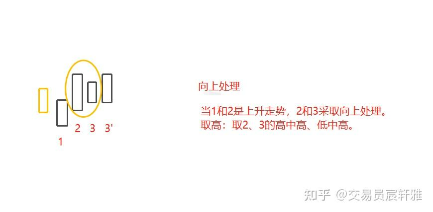

向上处理

（2）向下处理
向上处理一定是存在包含关系的K线处于一个向下序列中，即前面要有跟K线是非包含（或处理过的非包含）的向下序列关系。如图所示，1、2这两根K线是非包含的向下序列关系（出新高不出新低），3处于向下序列中，所以2、3的包含关系采用向下处理，取2、3这两根K线的低中低、高中低作为新K线3'（3'为新K线，代替原有的3）。

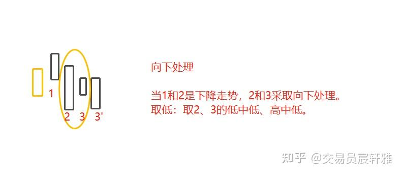

向下处理

### 2、遵循先左后右的处理顺序

**按时间顺序先后左右进行相邻两根K线的包含处理。处理后的新K线，仍可与右边相邻的K线进行包含处理**。

如图所示，当多跟K线存在包含关系时，就需要按照时间顺序进行逐次处理。先处理2、3的关系，2、3形成的K线3'后，新K线3'再跟第4根K线比较，处理完后形成新的K线4'。这就是逐次处理，遵循先左后右的处理顺序。

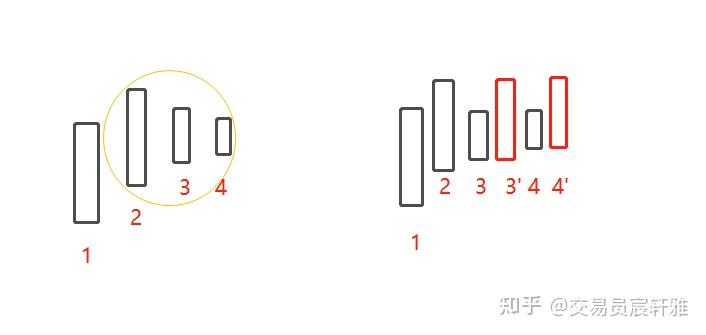

### 3、处理标准

（1）缠论原文处理标准
缠师在原文中给过两种处理方式。缠师把所有存在的包含关系的K线最终处理为非包含关系的K线，然后把存在包含关系的K线全部影藏，这是大家常见的一种。如图所示，2、3、4皆为包含关系，进行处理后，就只剩下1和新形成的2这两根K线了。

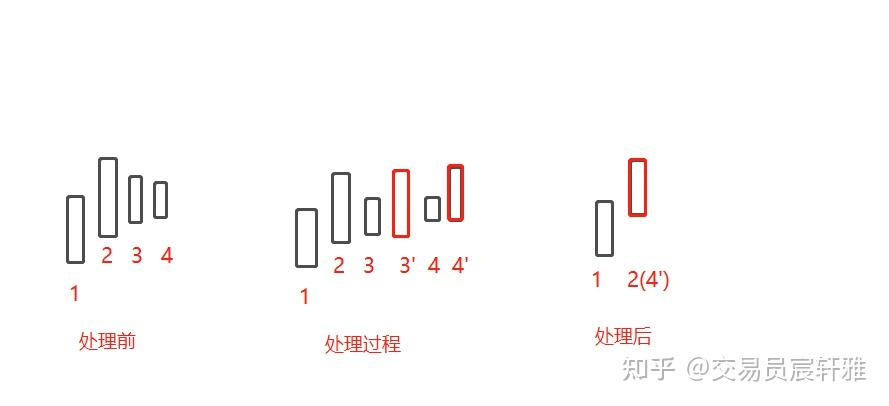

原文处理

（2）简缠处理标准
简缠的处理逻辑是逐一处理。缠论原文是把处理过的K线去掉了，只剩下新的K线，而简缠是不隐藏存在包含关系的K线的。如图所示，处理前是四根K线，处理之后还是四根K线，但它可能是个底部不断抬高的平顶。

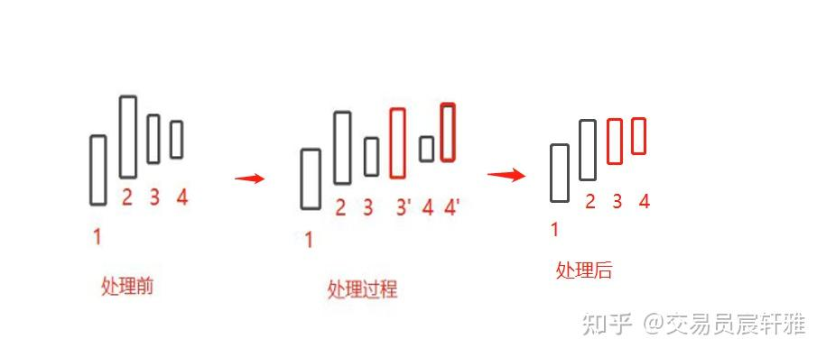

简缠处理

这样处理是为了满足整体性原则。一根长的K线出来之后，经过长时间的横盘，如果用缠论原文的处理标准可能只剩下两根K线了，整个横盘过程是不被显示的，对时间因子也有一定的破坏性；如果用简缠的处理标准，保留了时间因子， 就知道它经过了多少根k线。

简缠处理最大程度地保留了市场运动痕迹，无论是空间的还是时间的，同时，它的级别的一致性也能得到最大的保证，使市场的信息得以充分保留，所以我是基于这个原则提出了这个新的处理方式。

## 五、多跟K线包含处理步骤实例

对于多根K线的包含关系处理，可以按以下步骤进行，如图所示：

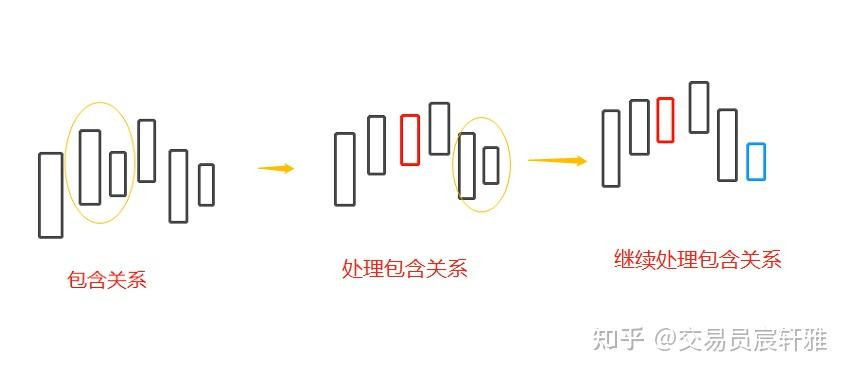

第一步：找到最左边具有包含关系的两根K线；
第二步：与前一根非包含关系的K线相比较，如果是处于向上（下）序列中，则采用向上（下）处理方式；
第三步：进行包含关系的处理（两根K线不作合并，保留K线在原位置）；
第四步：观察是否还存在具有包含关系的K线，若有，则重复第一、第二、三步，知道处理完所有包含关系。

**欢迎点赞收藏加关注，感谢支持。**