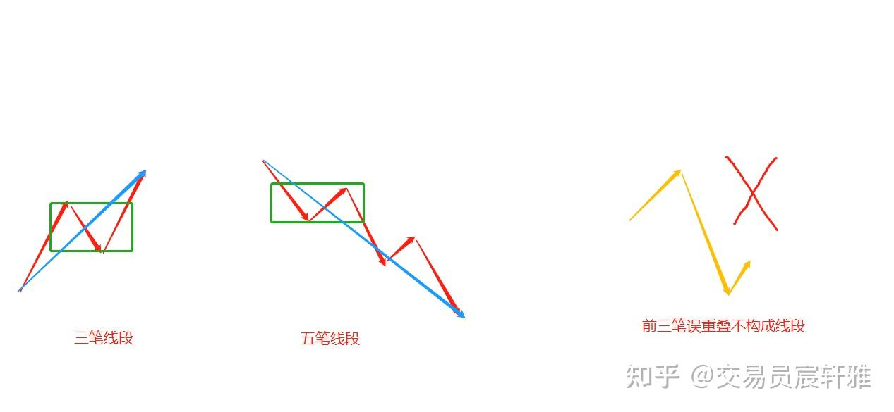
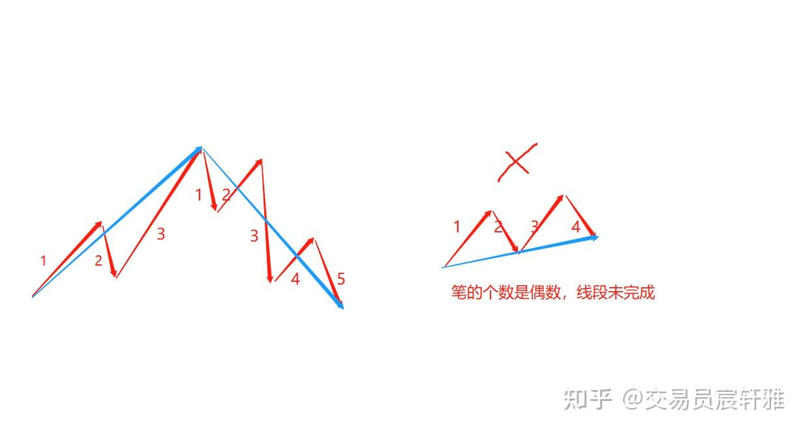
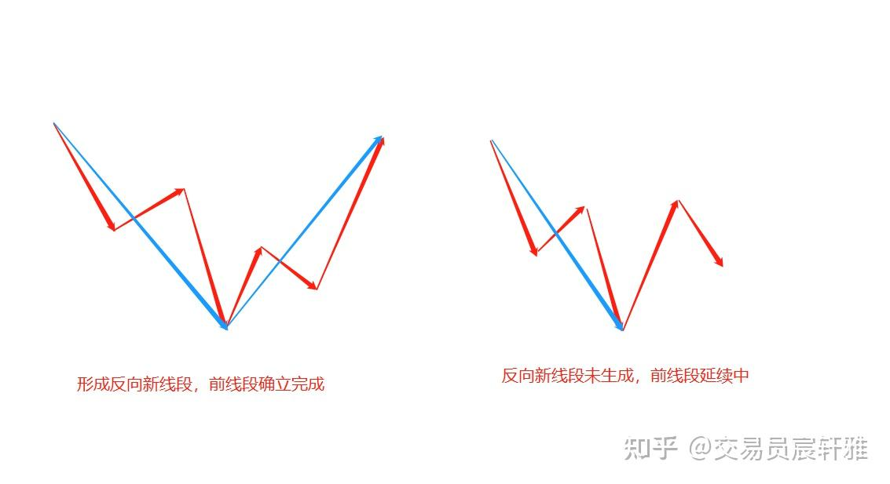
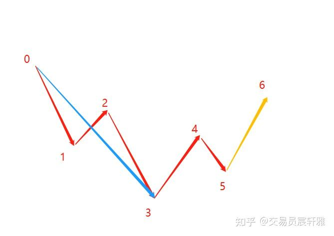
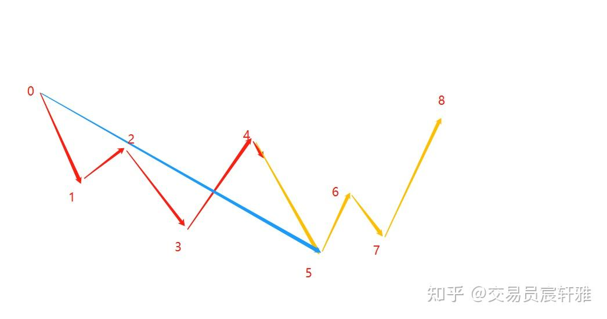
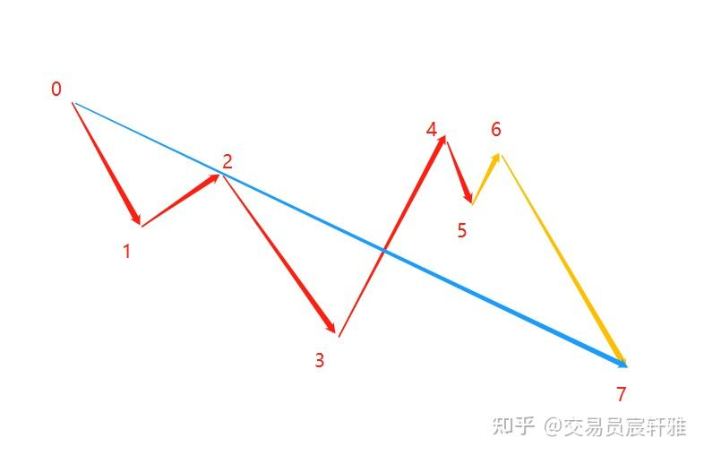
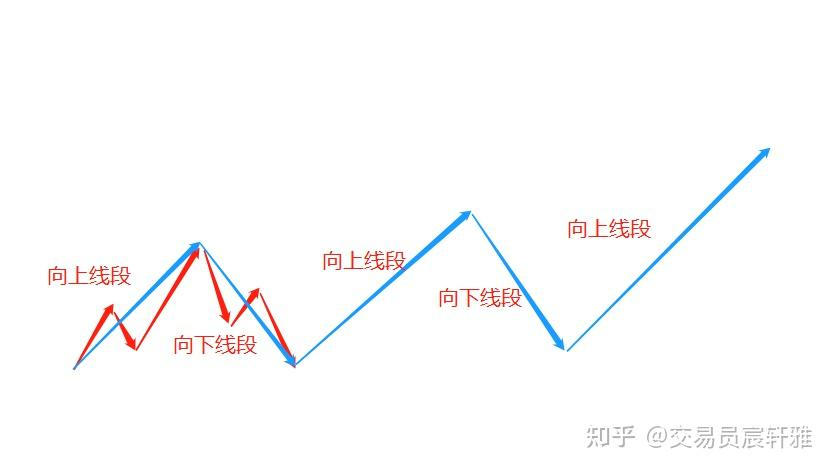
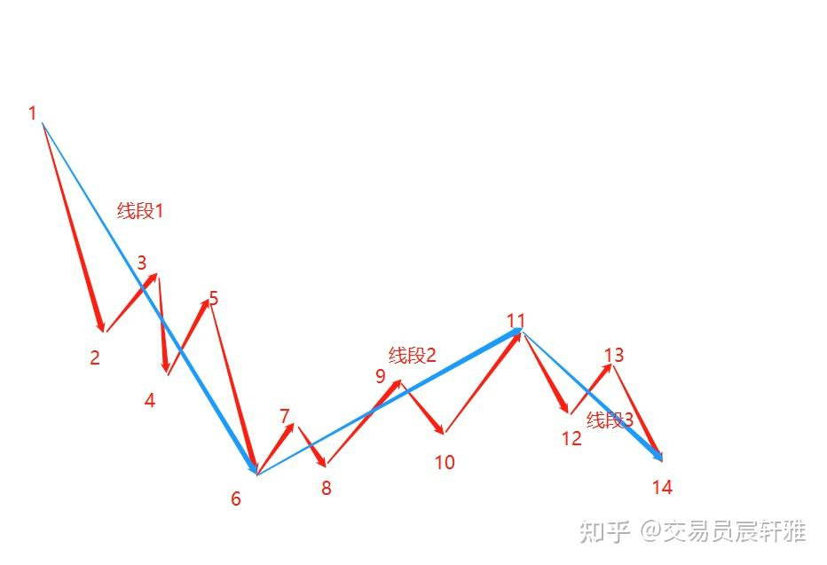
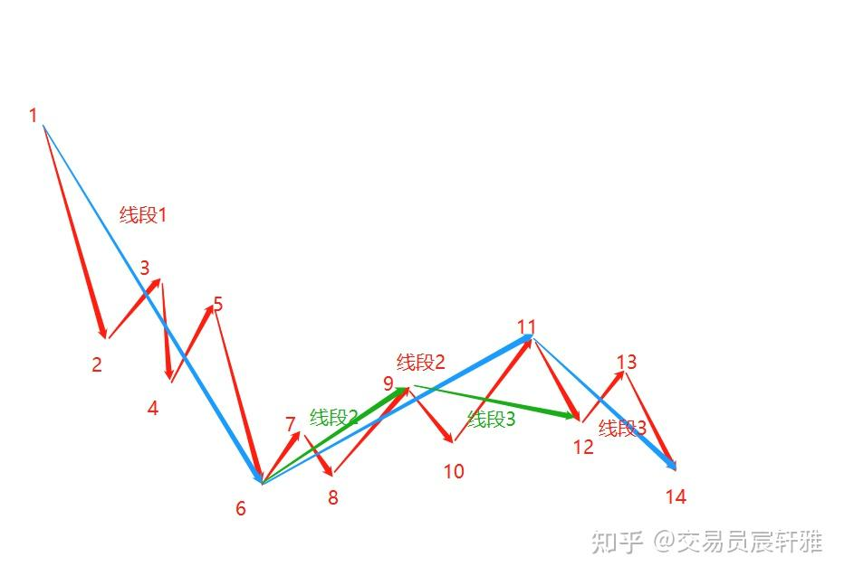

# 缠论基础——03 线段

## 一、线段的定义

**线段至少由连续的三笔构成，且起始三笔必须有重叠部分。**

线段的起始三笔必须有重叠部分，它可以有5笔、7笔等，不断生长下去，前三段没有重叠不构成线段。如图

线段

## 二、线段的方向

向上线段起始于向上笔，终结于向上笔；向下线段起始于向下笔，终结于向下笔。

如下图一个构筑完成的线段，其包含的笔的个数必然是奇数。偶数的线段，其实是没有完成的线段。如下图

线段的方向

## 三、线段的确立

**新线段生成才能确立前线段的完成。**

线段的确立与笔的确立是同一个逻辑，是一脉相承的。线段是否完成，一定要等一下个线段生成之后，才能被确立，反向的线段没有生成之前，前线段依然在生长延续中，如图所示。

线段确立

如图所示，0-3三笔重叠，构成了一个线段，如果之后走出了5-6这样的向上笔，构成了反向线段3-6，那么前线段0-3就可以被确立完成。

线段确认

但如果4-5这一笔向下延续，那么它依然是前线段的运动过程中，它是没有被确认完成的，必须出现一个反向的线段5-8，才能确认前线段0-5完成，如图所示。

线段确认

还有一种情况，如图所示，反向的第三笔5-6向上没有出高点，而后6-7向下破了3的低点，那么0-7依然是一个线段，它还是在线段内的延续。所以后面的线段没有被定义构成前，前面的线段是不可以称为完成的，这与笔的确立是一致的。

新线段未确认

## 四、线段的延续性

线段具有延续性，一个向下线段完成后，一定对应着一个向上线段；一个向上线段完成后，一定对应着一个向下线段。

通过定义就能清楚地知道，一个向上线段，必然是向下线段生成之后才可以确认完成，所以向下线段和向上线段是一一对应的，如图所示。

线段的延续性

## 五、线段的重要性

### 1、线段是缠论中构筑走势类型的最小组件

线段是整个缠论分析体系中一个不可逾越的环节，它是缠论中构筑走势类型的最小组件。笔构筑线段，这是缠论的第三层构建逻辑（K线构筑分型是第一层，分型构筑笔是第二层），而从线段构筑走势类型开始，我们将进入递归逻辑。

### 2、线段也是缠论中的一个分析单位

在实盘过程中，我们能看到一些很强势的走势，甚至会出现30分钟级别的大线段。当我们对缠论理解通透之后，就能对这样的走势有很清楚的认识，就知道线段原来是非常有意义的，它不仅是构筑走势类型的最小组件，还是操作过程中一个很重要的依据，线段的延续性是操作的客观基础。

## 六、补充说明

### 1、简缠对于线段的划分都是基于高低点之间的类型分别。

简缠对线段的划分和缠师对线段的划分时稍有区别的。缠师对线段的划分只要是由三笔及三笔以上构成，并且前三笔之间有重叠，就可以划分为线段。而简缠更遵从于高低点之间的划分，只要遵从于高低点，符合笔的个数是奇数，并且前三笔有重叠，就可以划分为线段。这能保证我们在分析走势时的便利性，所以我个人更倾向于此。

两种划分方法如下：

（1）按高低点划分（简缠），可以划分线段1、2、3，如图所示。

简缠线段

（2）按三笔有重叠划分（缠论原文）

对于线段1是一样的， 按照三笔重叠划分：线段2是从6画到9的，只要9比12高，9-12也可以看成新线段的生成中。后面如果还出一笔上道15，只要15比12高，12-15还是可以合成线段的，这也是完全符合线段的定义。如图所示，绿色线段。

缠师线段

两种划分方法没有对错，只要符合线段定义，就可以可以进行线段划分。遵从高低点，我们可以看得更清楚一些，对于初学者，掌握难度更小一些。

### 2、特征序列是缠师为推导理论而作的设定，对线段的准确划分给出了客观的量化标准。

我在讲简缠的时候没有过多提及特征序列，是因为在我的理解里，它是为了量化、为了推导理论而存在的，让我们在划分线段时有一个客观的标准。其实在实战运用过程中，没有特征序列也一样可以进行线段的划分。

### 3、对于操作的当下而言，建议完成地学习并且掌握缠论后，再投入实战。

学完"走势类型"，你会发现线段其实是更次级别的走势类型结构。因为缠论具备其大无外、其小无内的分析能力，它既能对一段走势进行简约化的分析，也能对同一段走势作最精密的分析，只要你愿意，完全可以用1分钟来分析一个几年形成的走势图。

等我们理解到这一层的时候，线段的划分就已经不是学习的难点了。所以我还是建议大家在初期阶段，先把线段的定义把握好，在日线或者5分钟上，对已完成的走势按照线段划分标准进行完整的划分。

**欢迎点赞收藏加关注，感谢支持。**