# 缠论基础——04 中枢

## 一、中枢的定义

**中枢：至少由连续的三个线段（次级别走势类型）的重叠部分构成** 。

一个向上的中枢必须是由下上下三个线段来构筑的，在标准模型中，中枢前面有进入段（向上的线段），后面有离开段（向上的线段），这样就构成了一个向上走势，如图所示。

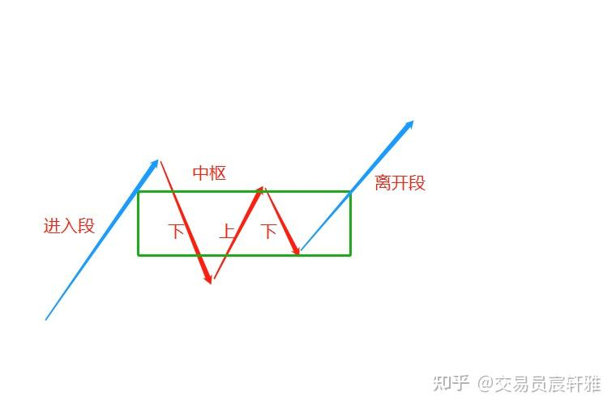向上中枢

一个向下的中枢必须是由上下上三个线段来构筑的，在标准模型中，中枢前面有进入段（向下的线段），后面有离开段（向下的线段），这样就构成了一个向下走势，如图所示。

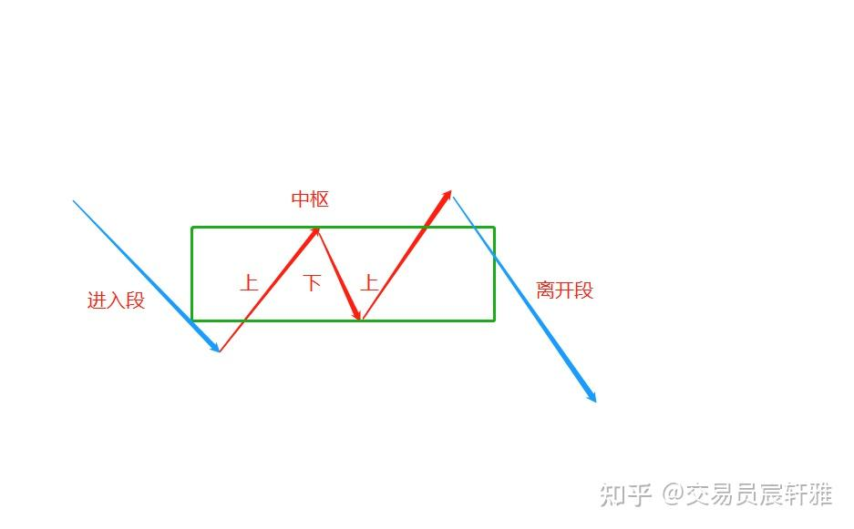向下中枢

## 二、中枢区间

前三个线段重叠之后，可以把中枢区间固定下来，而后在这个中枢区间内，可以有n个线段不断地在中枢区间内上下运动。

缠师在原文中对中枢区间有过两次定义：

第一种定义：中枢区间是由前三个线段的重叠部分固定下来的，取前两高点中的低点作为中枢高（ZG），取前两低点中的高点作为中枢低（ZD），ZG-ZD形成的区间就是中枢区间。围绕中枢运动的最高点，称高中高（GG）；围绕中枢运动的最低点，称低中低（DD）；如图所示。

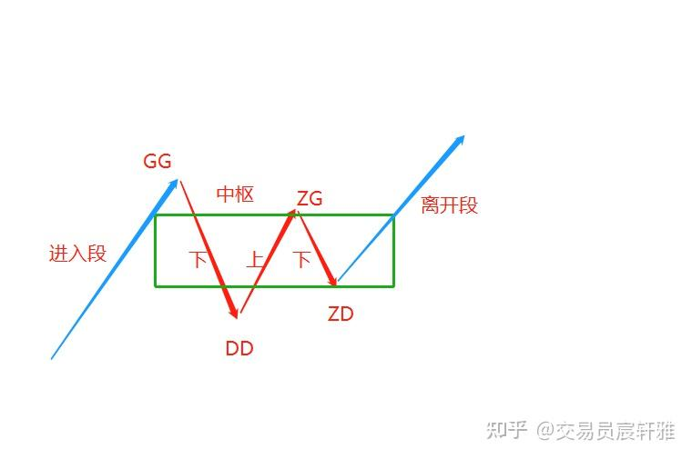第一种定义

第二种定义：所有构筑中枢的线段，每一个线段都会对应一个高点和一个低点，在这些高点中选取最低点作为中枢高（ZG），在这些低点中选取最高点作为中枢低（ZD），ZG-ZD形成的区间就是中枢区间，如图所示。

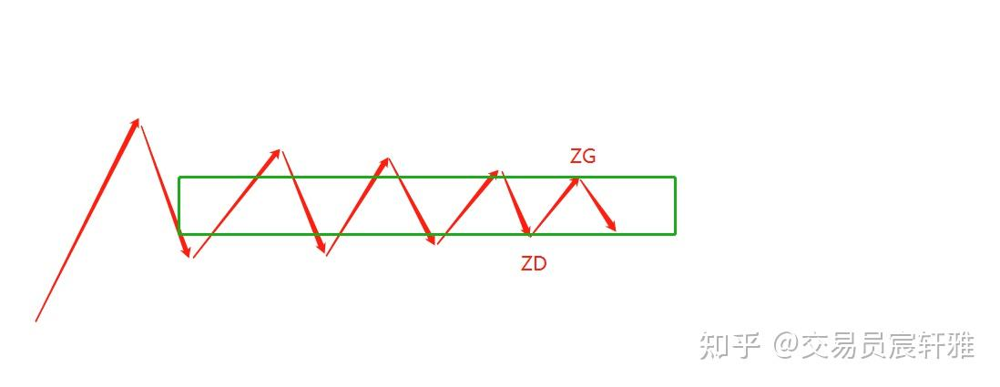第二种定义

第二种定义，在中枢不断延伸的过程中，ZG、ZD有可能发生变化，所以中枢区间也可能发生变化。

我通常采用第一种中枢区间选取方式，即由前三个线段的重叠部分来构筑中枢区间，因为这种方式对实战操作的意义更加重要。缠师在《教你炒股票》第92课里提到的“中枢震荡的监视器”就是基于第一种中枢区间的选取方式才能使用。当然用中枢内所有高点中的低点和所有低点中的高点来形成中枢区间的方法也是可行的，这种区间的选取方式对于第三类买卖点的认定会更加及时，所以两种方式各有优势和不足，随着经验的丰富，两种选取可以同时进行。

## 三、中枢的构筑

中枢的进入线段方向向上时，必须用下上下的线段来构筑中枢；中枢的进入线段方向向下时，必须用上下上的线段来构筑，如图所示。

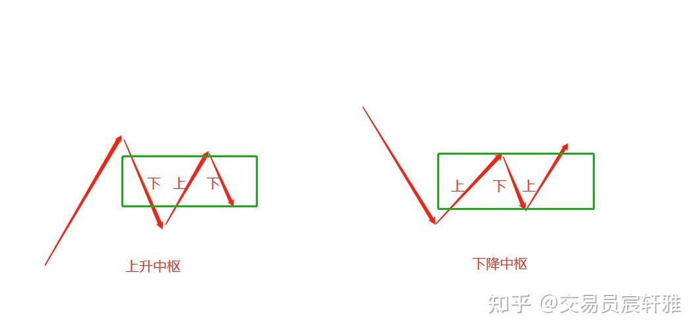构筑中枢

构筑中枢的三个线段必须有重叠。如图所示，1-4一开始是没有重叠的，当3-6产生重叠之后，才能把重叠的下上下进行中枢的构筑。一定要找到线段之间可重叠的部分才可以构筑中枢，而且构筑中枢的部分一定是要由走势的反向线段来构筑。

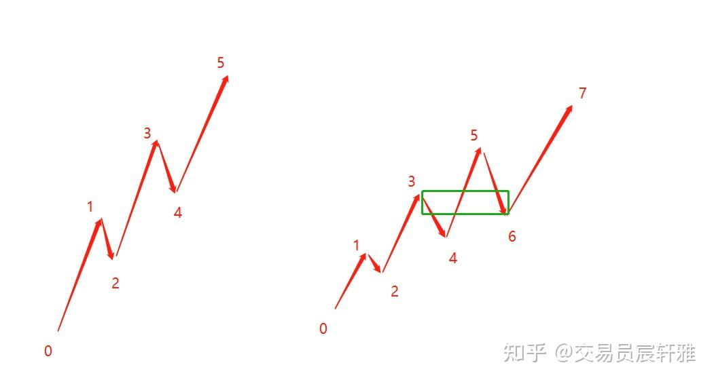

这是一个重要的逻辑：一个向上运动一定是找下上下的线段重叠来构筑中枢，一个向下运动一定是找上下上的线段重叠来构筑中枢。

## 四、中枢的方式

中枢本质上是没有方向的，其方向是被赋予的。中枢方向的赋予分两种情况：

### 1、形成中的中枢

**形成中的中枢，暂时用进入段方向来确定中枢方向。**

当中枢还没有出现第三类买卖点，中枢方向处于暂定期，即处于中阴段时，暂时用进入段方向来定义中枢的方向。例如，走势的进入段是向上的，那就去找下上下的三个线段重叠来构筑生成中的中枢。

### 2、形成后的中枢

**形成后的中枢，用第三类买卖点来确定中枢的方向** 。

中枢构筑完成：出现第三类买卖嗲（第三类买卖点是指一个次级别走势类型离开中枢，然后以一个次级别走势类型回抽，不重新进入中枢区间形成的买卖点。）

中枢从根本上说是没有方向的（即每个中枢本质上都是中阴段），在中枢的形成过程中时，是通过进入段来赋予其方向的；而当其完成后，第三类买卖点的方向，就代表了走势即将朝着这个方向发展。出现第三类买点意味着走势向上发展，出现第三类卖点意味着走势向下发展。而形成后的中枢，必是某走势的组成部分，而走势的划分并非固定不变的。我们只需明白，中枢的方向和其所在走势的方向是一致的，而中枢方向的不同会导致中枢组件的不同。如图所示：

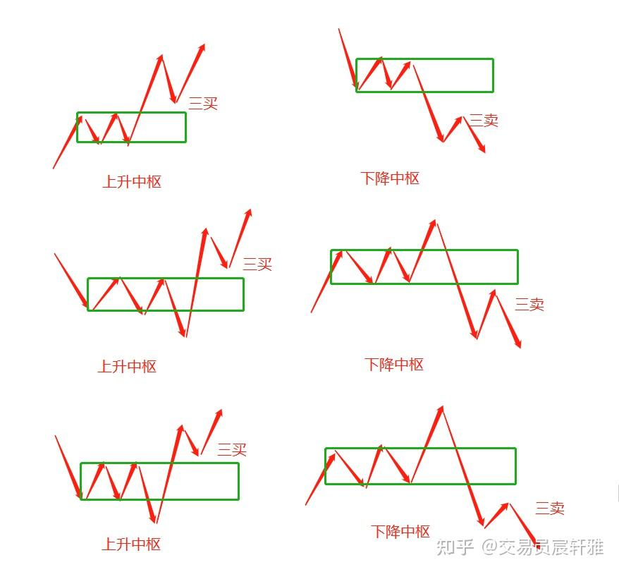

## 五、笔中枢和线段中枢

**由笔构筑的中枢叫笔中枢；由线段构筑的中枢叫线段中枢（即最低走势类型中枢）。**

虽然从构筑的结构来看笔中枢和线段中枢是比较类似的，但他们的组件不一样。笔中枢是线段的组成部分，线段中枢是最低走势类型的组成部分，它们的级别是完全不同的。

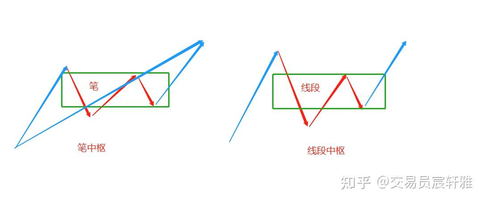

  

## 六、中枢的能量

用缠论分析走势图时，我更愿意把一个复杂的走势图理解为一个星际航行图。当我们完全理解缠论后，包括后面的背驰等动力学方面的理解，就会用到一个观念：**中枢是有能量的** ，且构筑中枢的组件数量影响着中枢的能量、中枢的级别以及大小中枢之间的从属关系。 **构筑中枢的组件越多，其能量（可理解为地心引力）也就越大** 。

这里有一个于实战运用上的补充定义，就是非标准结构。

**非标准结构：两个同方向的线段+中间具有破坏性的一笔（破坏度≧0.618）依然可以构成中枢，其能量小于完全由线段构筑的中枢。**

按照高低点划分的方法对线段进行划分，就会产生一些非标准结构：两个同级别、同方向线段+一笔构成的中枢，如图所示。

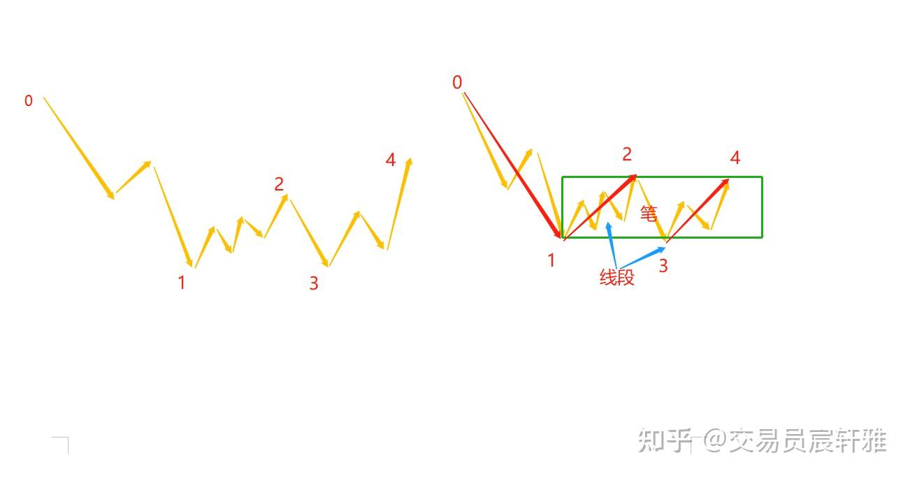中枢

当满足以下条件时，非标准结构可以看成是本级别的中枢：

一是1-2、3-4是两个同级别、同方向的线段且有重叠；

二是中间的连接笔2-3是具有破坏性的一笔，即笔2-3对线段1-2以及3-4的破坏度皆满足≧0.618（破坏度：2-3的高度除以1-2的高度≧0.618）。

那么形成的这一笔2-3可以进行特殊处理，把它当成线段用，1-4就可以构筑成一个本级别中枢了，但它的能力小于由三个线段构筑的中枢的能力。这是我经过理论推导出来的可用逻辑，在实际操作中对于非标准结构的处理还是很有意义的。

如图所示，0-7是一个向下运动，它是由上下上来构筑中枢的，1-2、3-4是两个同级别、同方向的向上线段，而中间的下2-3，仅仅是一个具有破坏性的笔，这时就可以近似地把1-4理解成一个线段中枢。

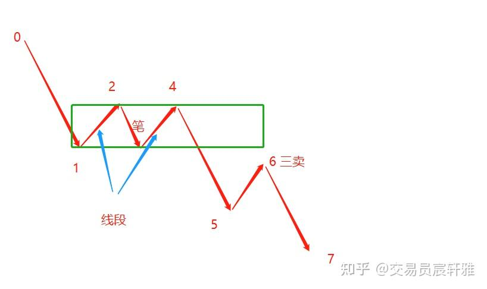

当你按照缠师的“不依高低点”来划分走势时，是不需要这个补充定义的。

## 七、奔走中枢

**奔走中枢：中枢区间的高度极小，第二个反向运动的低点（高点）刚刚接触前一个反向运动的高点（低点），最极端时ZG和ZD的价位相同，这样的中枢称为奔走中枢。此类中枢代表本走势动能充沛，其离开段的动能会更大些。**

如图所示，下上下所构筑的奔走中枢，它的接触面非常狭小，中枢构筑组件的大部分运动（80%以上的空间是在中枢外进行的）。

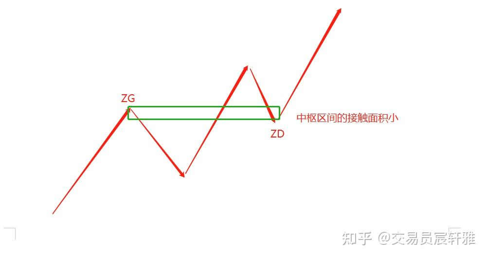

  

**欢迎点赞收藏加关注，感谢支持。**
