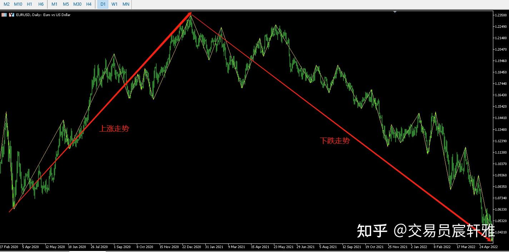
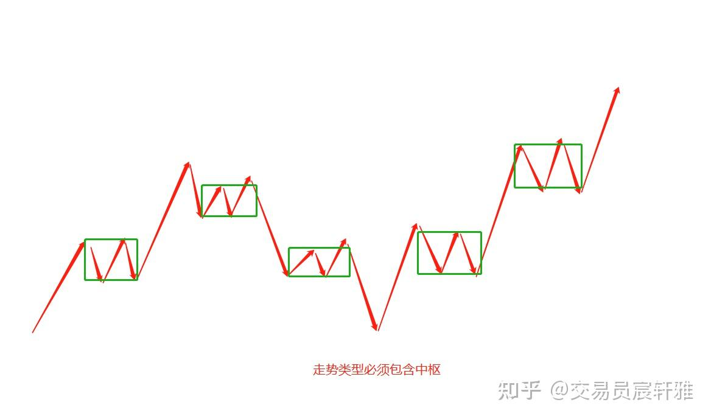
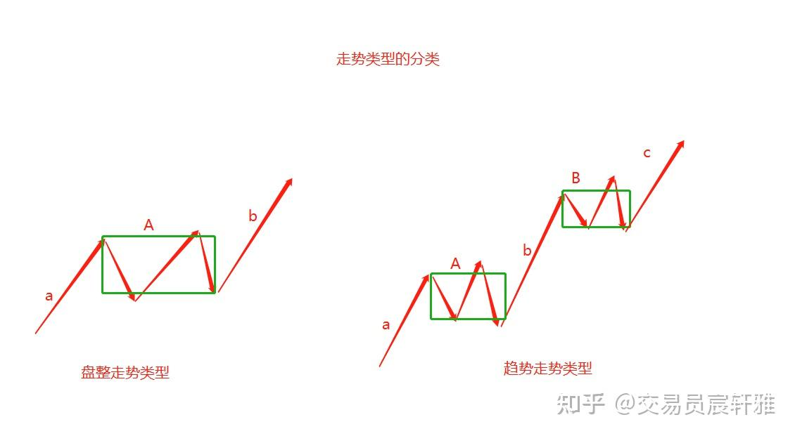
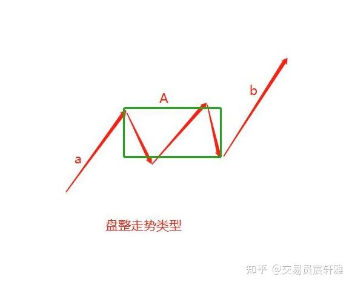
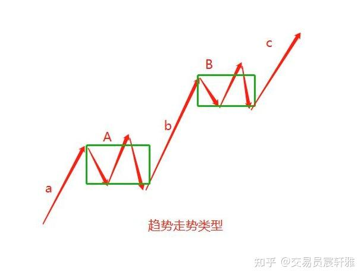
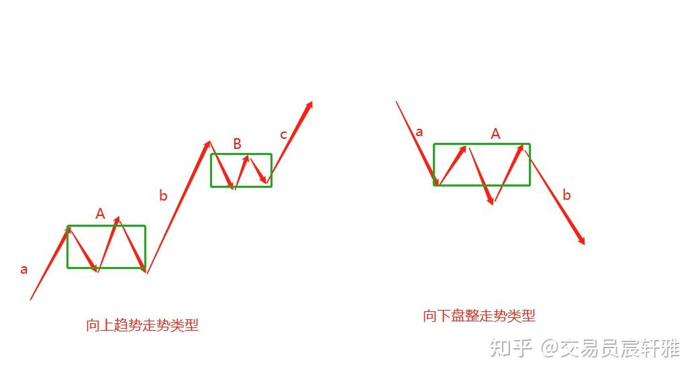

# 缠论基础——05 走势类型

## 一、走势的定义

任何周期图上看到的运动都是走势。

走势是缠论中最核心的逻辑，我们在交易软件上所看到的任何周期上的图，都是由不同走势所构筑的运动。走势从方向上分成上涨走势和下跌走势,如图所示。

日线图

前面的学习都是为了建立缠论特有的走势逻辑而作的准备工作。现在，我们先从静态的走势开始分析，逐步建立走势的完整定义，随着不断地学习，走势将慢慢鲜活起来。

## 二、走势类型的定义

**走势类型就是按照走势特征的不同而进行的划分**。

**走势类型的特征是指：组件是线段（次级别走势类型）以及中枢的个数**。

任何一个包含中枢的运动都可以定义为某一级别的走势。走势是对我们所能看到的一个向上运动或者一个向下运动的分类，缠论中走势的划分必须包含"级别"概念。

如果一个走势连最小的中枢都找不到，那它只能是笔：如果一个走势只是由笔来构筑的，那它只能是线段；如果一个走势只包含由线段所构筑的中枢，它就可以被定义为最低级别走势类型了，如图所示。

## 三、走势类型的分类

通过走势所包含的中枢数量的不同，可以把走势分成两种：盘整走势类型和趋势走势类型（这里的盘整和趋势，跟传统意义上的盘整和趋势是两个完全不同的概念，缠师只是借用了这样的名称来定义走势，如图所示）。

走势类型分类

### 盘整走势类型

在任何级别走势中，某一完成的走势类型只包含一个该级别中枢的走势类型，称为盘整走势类型（该级别中枢是指本走势中，最大级别的中枢有且只有一个，级别概念参考：[交易员宸轩雅：缠论——级别](https://zhuanlan.zhihu.com/p/546556838)）

盘整走势类型的标准模型表达式：a+A+b ， 如图所示。

盘整走势类型

其中：字母a表示中枢的进入段，字母A表示中枢，字母b表示中枢的离开段。

### 趋势走势类型

在任何级别的任何走势中，某完成的走势类型至少包含两个及两个以上、依次同向的该级别中枢的走势类型，且任何相邻的两个中枢的构成部分无任何接触，称之为走势类型。

趋势走势类型的标准模型表达式：a+A+b+B+c，如图所示：

趋势走势类型

其中，字母A表示第一个中枢，字母B表示第二个中枢，字母a表示第一个中枢的进入段，字母b表示第一个中枢与第二个中枢的连接段，字母c表示第二个中枢的离开段。

因为大多数的走势只有两个同级别、同方向的中枢，所以一般把c段当成是可能结束的离开段，也称之为背驰段。这个等我们讲"背驰"概念的时候会更加深入地去分解它。

## 四、走势类型的方向

走势类型的方向即是选取的A0（A0在: [交易员宸轩雅：缠论——多级别联立及不测而测](https://zhuanlan.zhihu.com/p/545629474) 中有详细描述）间的运动方向，当走势在构筑中时，走势类型的方向暂由进入段a的方向来定义（此点与中枢构筑时，中枢方向暂由进入段a来定义是一致的）。

a段为上，则走势类型的方向向上，称为向上走势类型；a段为下，则走势类型的方向向下，称为向下走势类型，如图所示。

走势类型方向

a段在已完成的走势里很容易找到，我们先要有能力对已完成的走势进行定义，生长中的走势需要运用更多的知识和逻辑，这个在[交易员宸轩雅：缠论——走势如何生长](https://zhuanlan.zhihu.com/p/545579538) 中有详细介绍。

## 五、走势类型的级别

**走势类型的级别大小是由它所包含的最大中枢级别来定义的，而不是由它的中枢数量来定义的**。

趋势走势类型和盘整走势类型只要他们所包含的最大中枢级别一致，它们就是同级别的走势类型，不能认为盘整走势类型就小于趋势走势类型。初学者可能会有一些疑问，或者说一种想当然的认知，这是不对的。

**欢迎点赞收藏加关注，感谢支持。**