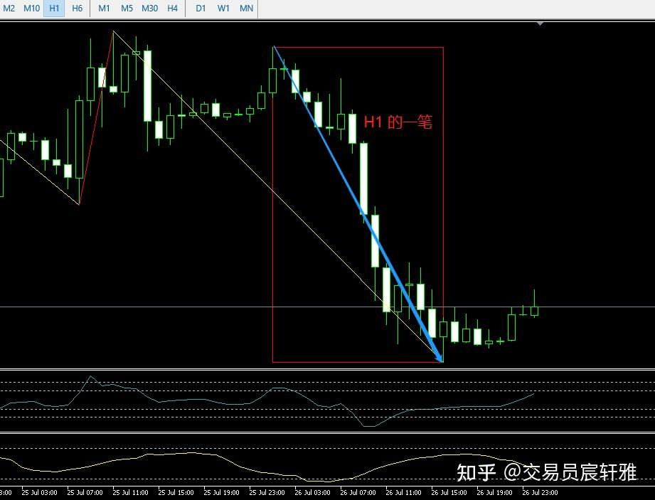
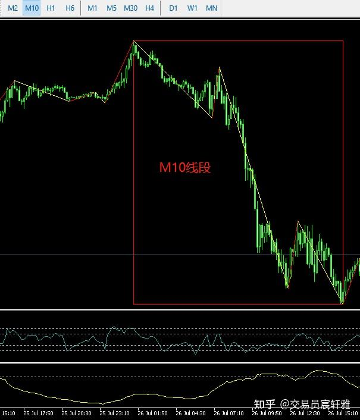
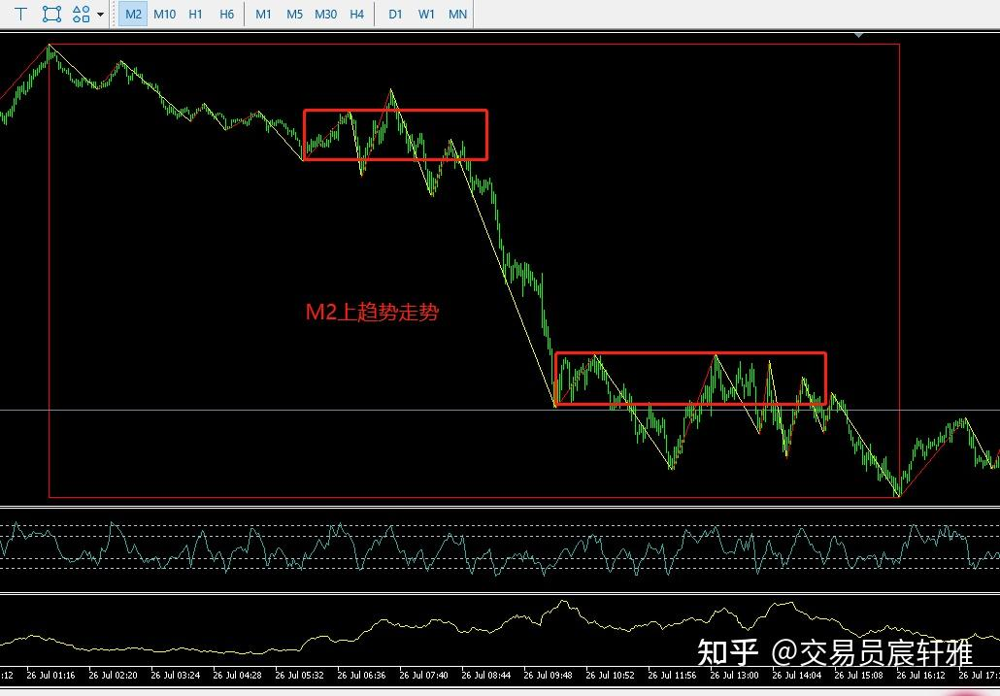
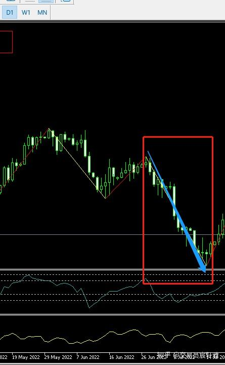
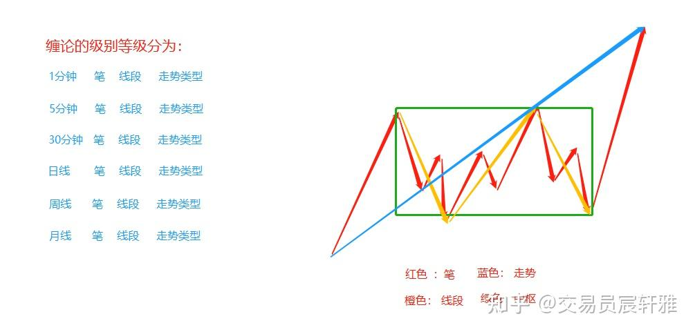
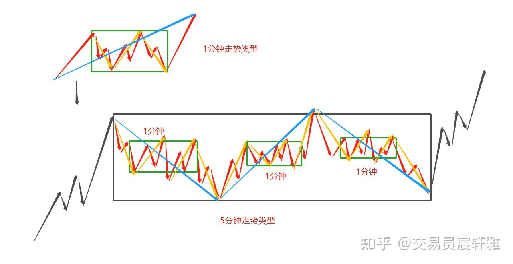

# 缠论基础——06 级别

级别在缠论中是作为度量衡般的存在，想要精确地定义走势是一定离不开级别的。 因为在原来的传统逻辑中更多的是模糊处理所有的走势，分析判断全部建立在感知上，而非定量分析上，所以很多人对级别是完全没有概念的。而级别是缠论有别于其他理论的标志存在（第一个是笔，第二个是级别），如果没有级别的概念，所有的走势划分、所有的定义就无从谈起。能够理解级别，才算真正踏入了缠论的殿堂，否则于缠论而言就是门外汉，所以级别是否领悟，这是辨别差缠论是否入门的分水岭。

## 一、级别的定义

**级别是缠论走势中的计量单位** 。

在1分钟图上，由1分钟的笔作为基础，生成了1分钟的线段，就是一次晋级；1分钟的线段在构筑1分钟的最低走势类型，又是一次晋级。

**缠论级别： 1分钟笔- >1分钟走势->1分钟标准走势**

## **二、级别的作用**

### 1、级别可以使任何的走势被唯一精确定义。

级别是用于正确、唯一地描述某一段走势的要素。有了级别，就能分清走势的从属关系，才能够在同一尺度下把走势清晰地划分开来。

表达一个走势，不仅要表达走势的方向，还要表达走势的级别。例如，30分钟级别的向上趋势走势类型、1分钟级别的向下盘整走势类型，走势就可以这样被定义和划分。

级别保证了缠论对走势的客观性表达。无论看哪一个级别的图，只有粗糙和精准的区分，它的级别是不会产生任何变化的。

如图所示是欧元H1的一笔， 是10分钟的线段，是2分钟的趋势走势类型，它们都是在描述同一段走势，只是选择了不同的计量单位（在描述走势时，其精度是有差异的）。

H1 笔

M10线段

M2 趋势走势

### 2、没有级别的概念，所有的走势划分就会发生混乱。

没有定义级别的概念前，对于走势图，我们只能大致说这是一段上涨，或者用波浪大致描述目前处于第几浪中，但这些描述都是因人而异的，而运用缠论我们就能统一精准地描述同一段走势了。这个精准、统一描述的前提是我们的级别定义是相同的，换句话就是我们的递归标准是统一的，最起码自己的级别标准需要固定，这是分解走势、构筑走势的前提。

所谓"千人千缠"就是因为大家的级别递归函数不同造成的，我用的是英国的盎司，你用的是中国的斤两，度量衡不同，称量出来的数值自然是不同的。只要每个人的递归逻辑（函数）保持一致，级别就不会发生任何的混乱，这样就能解决"千人千缠"的问题了。

三、级别与时间周期的区别

**时间周期是用1分钟、5分钟、30分钟、日线图、周线图、月线图来表示，与级别无关。**

**级别由走势的组件（次级别走势类型）来定义。级别只跟走势类型相关，而最小的走势类型必须有中枢** 。

没有任何中枢的走势只是走势的组件，例如，笔没有任何中枢，它只是走势的组成部分。当然，在对走势的描述里，也可以用走势组件的名称来表达的，比如可以表达这是一个1分钟向上笔，那是一个周线向下笔。

这里介绍一个快速、精准地定义走势级别的方法：把走势从大周期图到小周期图逐次地观察，哪个周期图上能够找到**线段** 构筑的中枢，就可以定义这是哪个的走势了。

案例：欧元选定区间，从日线或H4上看，都是向下一笔。

H4 笔

日线 笔

## 四、级别生长

### 1、缠论中对走势的级别描述。

缠论对某段走势的级别描述，必须包含两个部分：周期级别+走势的类型或者走势的组件名称，如图：

缠论级别

周期级别：它是在哪个周期图上被观察的，比如它是在1分钟图上、5分钟图上、还是30分钟图上被观察的。

**走势的类型或者走势的组件名称** ：它在某周期上表达的是什么。比如它表达式笔、线段（走势组件），还是走势类型（盘整或趋势）。

一段走势的表达必须包含周期级别以及走势的类型或组件，例如，1分钟的笔、5分钟的线段、30分钟的盘整走势类型、日线的线段、周线的笔。

在目前阶段，按照这个方法就可以基本准确地定义我们需要定义的走势了，随着后面的学习，会逐渐明白真正意义上的级别概念。级别其实是通过递归逻辑来完成升级的，是不因时间窗口的选取而变化的，我们会在后面再来详解此点。

（1）选择观察窗口的周期越大，级别的定义越粗糙。

**周线一笔可能是1分钟的一笔，也可能是5分钟甚至30分钟的走势类型。**

首先要把观察的时间窗口和真正意义上的级别做区分，他们是两个完全不同的、不可混淆的定义。在周线图上看到的一笔，可能只是1分钟的笔，也可能是5分钟的走势类型，或者30分钟的走势类型，它只是可能和或者，因为它粗糙。但这个简约的办法也有优势，就是可以快速锁定我们需要的大周期走势结构。

（2）精确定义走势的步骤。

先锁定一个走势的开始端点和结束端点，而后逐级放低观察窗口的周期（切换周期时，要保证开始端点和结束端点不变化），直到找到由走势类型重叠形成的中枢所在的周期为止，这个走势的级别就是观察窗口周期为次级别走势类型所构筑的标准级别。

如果直到最小周期窗口（设定1分钟图）都没有重叠的走势类型，那这个需要定义级别的走势就是1分钟的笔或1分钟的线段。

例如，在周线图上看到是1笔，那么逐渐放低窗口去找，日线图上，周线的这一笔依然找不到重叠的中枢，那就看30分钟图，如果在30分钟图上，他是一个由笔构成的中枢，那么周线的这一笔就是30分钟的线段。

继续往下看，5分钟图上，30分钟的一笔对应的是5分钟的线段。也就是说5分钟图上看到的中枢是由5分钟线段所构筑的，那么在以5分钟作为最小观察单位上，就能得出，这是5分钟最低级别走势类型。

找到5分钟线段所构筑的中枢窗口，其实还不够，还要往下看。在1分钟图上看到原5分钟线段对应的是1分钟最低级别走势类型，1分钟最低级别走势类型成为中枢的构成组件，那么这个走势就是5分钟标准走势类型，至此，这个从周线一笔开始观察的走势，其最标准的定义是：5分钟标准盘整走势（本走势有且只有一个由1分钟最低走势类型构筑的中枢）。

这就是精确定义的逻辑，需要不断往下看。

实战中，我们一般采用简约高效的办法，找到线段构筑的中枢即可停下来。例如，一段走势包含30分钟线段构筑的中枢且本中枢是这段走势最大级别的中枢，则本走势是30分钟走势类型。

### 2、递归

（1）递归就是在运行的过程中调用自己。

递归是缠论中很重要的一个计算方法，就是在计算过程中用它原规则不断地调用自己，不断地长大的一个过程。

（2）递归的数学模型其实就是归纳法。

（3）递归是一种重要的编程技术，其方法是用一个函数从内部调用自身，生出结果又被重新调用。

（4）斐波那契数列就是典型的递归案例，递归关系就是实体自己和自己建立关系。1、1、2、3、5、8、13......

### 3、递归方式

缠论中的递归关系涉及级别的生长，我在梳理级别的过程中，发现缠论原文用了三层构建逻辑和两种递归方式。

**三层构建逻辑（起始程序）** ：

第一层：在1分钟图（选取1分钟图为最低观察单位，当然也可以从5分钟，15分钟图等开始）上用K线构筑分型；

第二层：分型构筑笔；

第三次：笔构成线段。

**两种递归方式** ：

首先第一递归函数生成第一级别：线段构筑最低级别（本级别）走势类型。

再用第二递归函数生成第二级别并不断向上递归；本级别走势类型构筑大一级别走势类型，大一级别走势类型构筑大二级别走势类型，并不断向上递归，即n级走势类型构筑n+1级走势类型。

能够理解和掌握上述描述，对级别的认知就进入了全新的层面，就可以开启从1分钟的K线图不断构筑到5分钟、30分钟以及日线等走势，你就会明白，1分钟、5分钟、30分钟的划分不过是为了方便，其实级别的定义从秒级别开始都是可以的，而后生长到第一级别走势类型、第二级别走势类型，直到第n级别走势类型，这时的你，已经摆脱了图形周期对你的束缚，至此，任何的一个价位都可以被唯一标注了。

**三个连续次级别走势类型重叠生成高一级别走势，得到走势类型后的递归都采取这种递归方式** 。

走势类型不断地向上递归：在1分钟图上用线段生成1分钟最低级别走势类型之后，由1分钟最低级别走势构筑5分钟走势类型。

如图所示，三个1分钟走势类型的重叠生成了5分钟走势类型的中枢，也就定义了5分钟走势类型，5分钟的走势类型重叠就可以生成30分钟走势类型，就这样一层一层地递归上去。

5分钟走势类型

需要注意的是：这里的1分钟、5分钟、30分钟只是常用的一种标记，是为了取用方便，实际过程中，它其实是无极的。也就是说在1分钟图上就可以不断地生长下去，形成1级图、2级图、3级图、4级图等。我们只是约定俗成地说这是1分钟构筑了5分钟，其实它是第一级构筑了第二级，很多人会把这样的概念跟原有的名称混淆。

那么，有人可能会说，我把第一级命名为5分钟可以吗？其实这都是没有关系，当然可以用5分钟上的线段作为最低的层次来构建走势。

## 五、一个表格理解走势级别的生长

走势的组件，是从K线开始的，K线到分型，就是一种升级方式，即通过特征及特征处理的规则来对K线进行处理升级。所有的升级方式都是根据特征处理的规则来构建的。由K线通过规则把它升级为分型，而后，分型合为笔，其实也是一次递归，只是这个递归逻辑只在讲特征序列时用了一次。由笔通过规则构建为线段，这也是一次递归，这个递归逻辑在构建大线段时用过一次，如图所示。

内容| 升级方式| 升级结果  
---|---|---  
K线（走势组件）| 笔的定义| 笔  
笔（走势组件）| 线段的定义| 线段  
线段（递归方式一）| 三个线段的重叠构成一个中枢| 最低级别走势类型  
次级别走势类型（递归方式二）| 三个次级别走势类型的重叠| 本级别标准中枢  
  
这里再强调一下走势类型的递归有两种：

第一种：以线段的重叠升级成最低级别的走势类型的递归方式。

可以一直沿用这种递归方式，只用线段构筑中枢的方式来定义走势。例如，用日线的线段作为最低级别分析，那么由日线的线段所构筑的中枢就可以被定义为日线级别的走势类型。这是一种快速锁定和定义级别的方法。

第二种：用次级别走势类型来定义的递归。

这是缠师在缠论原文中不断强调的，也是我个人比较推崇的一个递归方式。因为这种递归方式可以到最低的1分钟去开始构建，这是最标准的缠论递归方式。先用第一种递归方式来组件最低级别走势类型，只要得到了最低级别的走势类型，就可以用第二种递归方式来构筑第二级、第三极、第四级的结构，就这样逐级升级上去了。所以只要最初级的走势类型被定义下来，那么这个走势类型就可以不断地生长，不断地定义下一个级别，我们就不会再混乱了。

由次级别走势类型所定义的中枢，我们称之为本级别的标准中枢。第一种递归方式，是用线段来构筑最低级别走势类型的，从第二级别开始，第一级别（最低级别走势类型）就变成了次级别走势类型，由它来组件更大级别的标准中枢，或者叫定义更大级别的走势类型的级别。

当我们掌握了级别递归以及它的逻辑之后，任何跟你级别理解有冲突的地方，你就能够找出到底是因为起点不一致产生的问题，还是因为递归规则不一致产生的问题。级别因人而异，只是因人对级别的定义不同，而不是走势本身不同。走势怎么划分，其级别都是唯一固定的。只是因为大家称量的尺子，或者说选用的进制不同，所以称出的重量值不同，并不是因为物体本身的重量不同。所以先把尺子统一了，这个值就一定相同了。

**欢迎点赞收藏加关注，感谢支持。**
