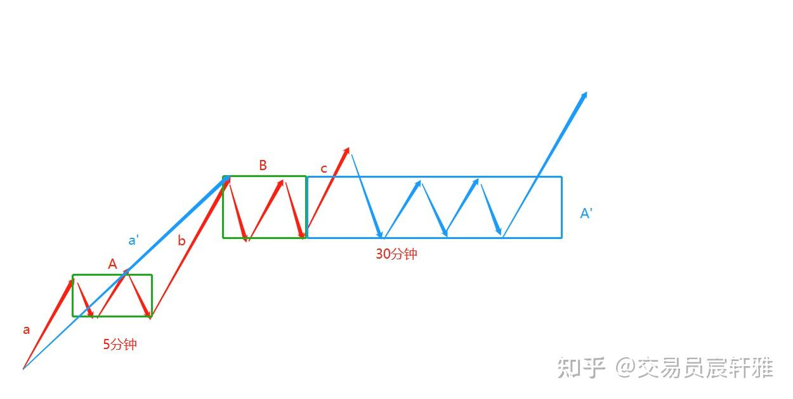
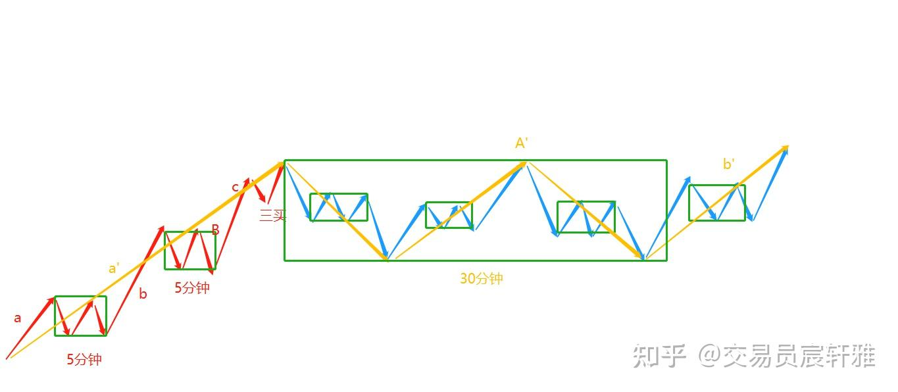
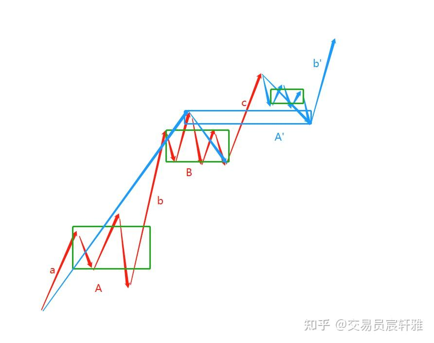
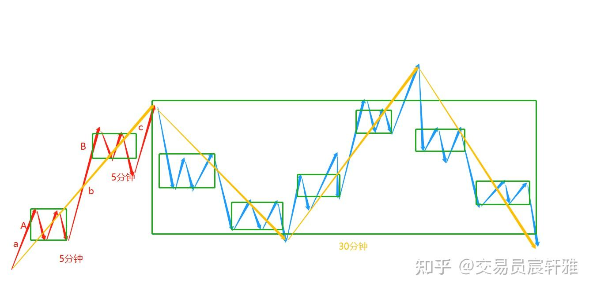
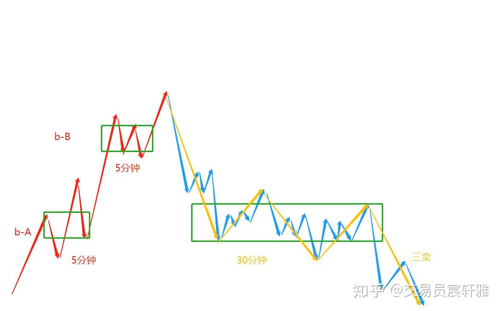
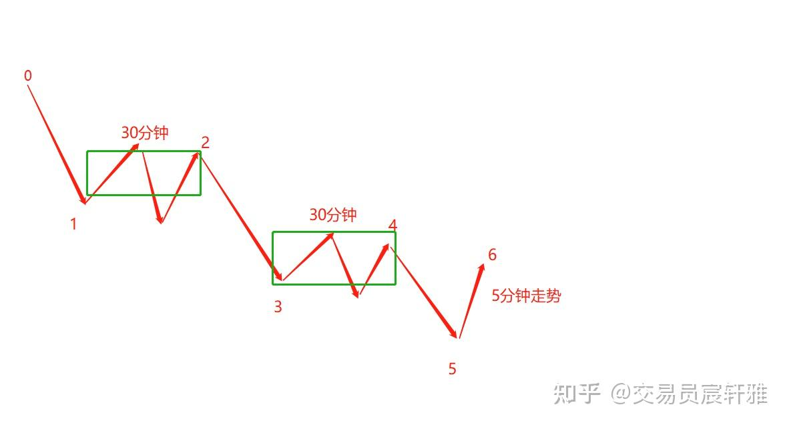

# 缠论基础——14 走势如何生长

## 一、走势生长的意义

### 1、没有走势生长的概念，就无法清晰地定义当下。

进入中枢生长之后，已经处于一个动态的分析过程中。如果没有走势生长的概念，是无法清晰定义当下的，也无法对后期的运动进行不测而测。

### 2、走势生长是走势必完美的动态展示。

（1）走势必完美是交易必须遵循的指导原则。

（2）走势生长是走势完美的过程。

（3）只要标的不退市，其走势就在不断地生长中。

走势生长是描述行情如何演绎的过程，只有于生长中进行交易才能够真正地顺应市场，这是缠论的立论基础。我们是跟随市场的生长以及跟随市场的力量变化进行应对的。

建立走势生长的概念，对所有走势才能一目了然，才能明白身在何处。

例如，一个外汇标的，通过缠论完全可以定义当下处于哪一段，并且是被唯一定义的。通过对其部分不断用区间套划归层次逐渐地锁定，可以锁定到1分钟上，甚至是秒级别。

## 二、走势生长的定义

**走势生长即走势的级别在升级中。**

走势的级别是由走势所包含的最大中枢级别来定义的。

走势如何生长即走势内最大中枢是如何升级的，以及中枢升级带来的走势结构从属关系的重新定义。

## 三、走势生长的方式

1、连续的本级别走势类型的重叠形成更大级别的走势类型的中枢，从而完成本级别到更大级别的生长过程，即中枢的扩展导致走势升级。

2、本级别中枢通过延伸、扩张完成更大级别的中枢升级，从而导致走势升级。

## 四、走势生长的三种模型

走势生长的三种模型是禅师所定义的。一个趋势走势类型发生背驰后，会对应三种变化。

  * 以最后一个中枢为基础构筑中枢升级（延伸、扩展、扩张）
  * 对应一个同级别的反向趋势
  * 对应一个更大的反向走势

### 1、趋势背驰后，以最后一个中枢为基础构筑中枢升级。

（1）中枢延伸方式。

如图，一个5分钟趋势背驰之后，围绕中枢B以中枢延伸的方式形成了中枢的升级，升级后原有的中枢B成为更大级别的A'的组件，原有的a+A+b成为了更大级别的a'。

中枢延伸升级

（2）中枢扩展方式

如图所示，一个5分钟趋势背驰之后，围绕着中枢B以中枢扩展的方式形成了中枢的升级，形成30分钟中枢A'，原有的5分钟走势变成了30分钟走势的a'。

中枢扩展

中枢A'可以在原有5分钟中枢B的范围内进行构筑，也可以在整个a'的范围内进行构筑。而原有5分钟中枢B不需要纳入到新中枢A'中。

（3）中枢扩张方式

如图所示，一个5分钟趋势背驰之后，围绕着中枢B以中枢扩张的方式形成了中枢升级，那么原有的a+A+b就变成了一个30分钟走势的a'，升级后原有的中枢B和c均成了新的30分钟中枢A'的组件。

中枢扩张

### 2、趋势背驰后，对应一个同级别的反向走势（构筑更大级别中枢）。

如图所示，一个5分钟上涨趋势走势类型，c段背驰后对应一个5分钟的下跌走势，如果后面再形成一个5分钟上涨走势和一个5分钟下跌走势，那么它就已经构筑了一个更大级别的30分钟中枢了，整个走势也就通过中枢扩展的方式完成了升级。这与第一种围绕原走势的最后一个中枢展开不同，这种方式没有限定同级别运动的波段范围。

更大级别中枢

3、趋势背驰后，对应一个更大级别的反向走势。

如图所示，一个5分钟走势结束，后面对应一个反向的5分钟走势，而后这个5分钟走势又生长出一个更大级别的30分钟中枢，这也属于正常现象。

反向运动的中枢升级方式（围绕次级别走势中枢的扩展生长）不是唯一模型，还包括另外两种中枢升级方式：中枢延伸和中枢扩张，它们都可以使反向运动升级一个更大级别的反向运动。

一切的走势变化是不测而测的，是以市场为准的。掌握走势生长的三种变化模型，是不测而测的基础，走势在没有开始出现生长前，它有n种变化，生长的那一瞬间它就被唯一定性为它是谁。

走势生长的推演是一种能力，这种能力决定了每一个对缠论掌握的高低，有人只能推演一、二层级别的走势变化，而更高能力的人能推演到三到五层级别的走势变化。这种推演能力不单是上下这样的运动，更多的是能够推演到几层级别的走势变化运动，推演的层级越高，对行情不测而测的应变能力就越强。

这也是禅师所说的：第一，不为外道所用，如果只倾向于某一种变化，是运用不好缠论的。第二，同样掌握缠论的人，其能力是有高低之分的，不是说学会缠论，大家的水平就一致，而是根据对不测而测的推演能力，或者叫走势演变的推演能力来决定能力层次的高低。就像下象棋，有的人只能算三步，而真正的高手可能会算十步，他们的能力完全不一样。

掌握走势的生长，就能够真正看到市场花开花落的美妙景象，不再为市场的起伏变化而忧虑。

## 五、力度分析

**本级别走势结束一定对应一个反向的次级别走势，这是理论所保证的** 。

如图所示，一个30分钟走势结束后一定会对应一个反向的5分钟走势。如果5-6连5分钟走势都没有，那说明4-5这个向下的5分钟走势没有结束，5-6只是4-5这个5分钟走势的一个组成部分。所以在0-5这个走势一定结束于5这里的保证下，0-5一定能对应一个反向的5分钟走势。

**在这个理论保证下，我们来探讨它对应的反向的次级别走势的力度** 。

走势生长的三种方式，在实际操作过程中如何才能知道它会走哪一种？其实只需要把握好第一段。无论后期如何变化，第一个次级别的反向走势是必然会出现的，而后就可以通过走势生长的次序以及强弱来逐步观察应对了。

### 1、中枢延伸

中枢延伸的起始回落（上涨）段力量不足时，在最后一个中枢的范围一般会形成一定阻碍，可以利用次级别走势的完成来触发反向的操作动作，当最终生成一个更大级别的中枢时，就要考虑随后可能出现的走同向的新的离开段。

### 2、中枢扩展

中枢扩展表达的是走势处在一个更大级别的中枢构建中，这时需要多级别联立的思维，观察更大级别的走势情况，同时考察第一段次级别反向走势是否脱离原中枢的范围，以及后续次级别走势是否在构建反向的本级别走势。

### 3、更大级别的反向走势

更大级别的反向走势，一般其初始段的反向运动动能较强，其反向运动的持续性更好，且要走出更大级别的反向走势，至少需要三个以上的本级别运动，可供观察的节点多。

走势是生长出来的，并非一开始就能确认一定可以走哪一种走势，我们需要掌握的是对走势生长的跟踪考察能力，而不是一开始就去猜市场会走哪里一种走势。

## 六、中枢生长与走势生长的关系

### 1、中枢生长引发走势生长

掌握了中枢生长，就能够很清晰地知道中枢生长所引发的走势生长。

### 2、走势生长关注从属关系的确立，中枢生长关注中枢级别是否发生升级

走势生长的关注点是其组件的从属关系是否因中枢级别生长而发生改变，并依照升级后的中枢重新定义走势级别及从属关系，走势也就变得当下以及唯一了。而中枢生长的关注点是中枢级别是否发生升级，这是两者截然不同的区别。

### 3、当下的走势，不是在中枢构建中，就是在中枢移动中

当下的走势不是在中枢构建中，就是在同级别的中枢移动中，或者说次级别的中枢发展中。例如，它不是在构筑中枢A就是在b-A中，要不就是在构筑中枢B，中枢B又可以演变成更大级别的中枢。通过这样的生长，我们就可以很清楚地知道它在干什么。

  

**欢迎点赞收藏加关注，感谢支持。**
