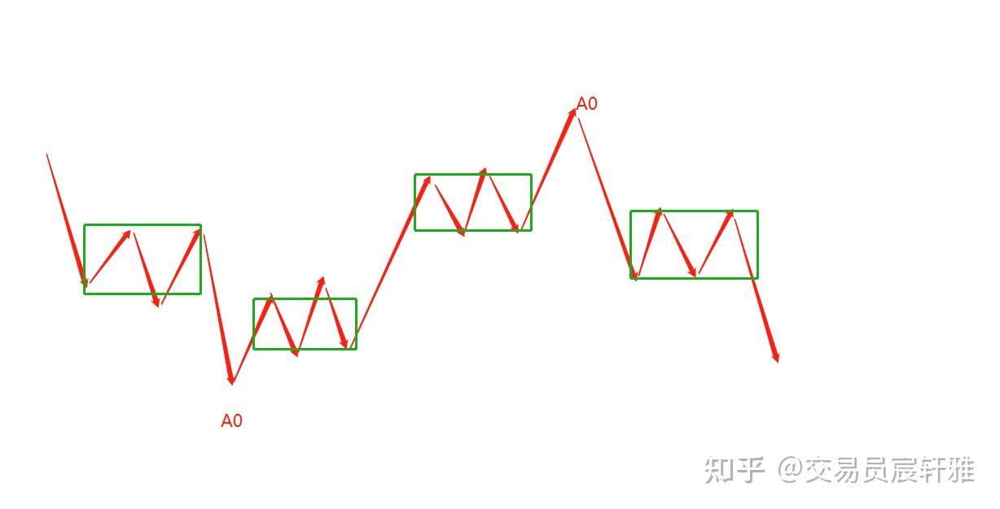
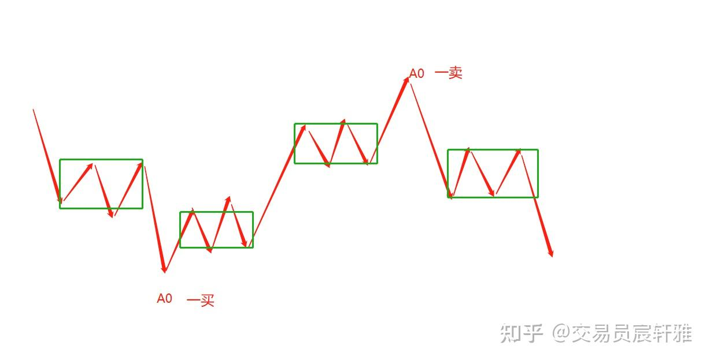

# 缠论基础——15 多级别联立及不测而测

多级别联立及不测而测是缠论的综合运用部分，也是缠论基础的最后一个要点。

## 一、多级别联立的概念

**1、级别的概念使任何一个走势都可以被唯一标识。**

**2、任何走势都是由其次级别走势来完成构筑的。**

**3、当下所处位置需要多个级别的走势从属关系来同时定义和演绎。**

走势不是某一级别的表达，而是在整体观下的、多级别的从属位置进行一个更客观准确的表达。 就像你要寄东西，光写你家的门牌号，东西肯定是不能被邮寄到的，你需要具体写到某省、某市、某街道、某门牌号才能寄到。它是一个从属关系，在这种从属关系下，位置才能被唯一确定，走势也同样如此。

**4、多级别联立强调的是在整体的保证下来观察其演绎。**

有了这个思路，我们才能准确地去判知目前市场的所处位置，或者更低级别上的变化是否导致整体变化，是否要再向上一级别来考虑定位（整体是相对的），所以多级别联立更强调的是整体下的观察。

**5、多级别联立的分析过程是对走势分解及组合的过程。**

**在讲多义性的时候，大家已经观察到，在结合律的保证下，走势只要重新拆分组合，就可以被不同定义，所以在大级别下已完成的结构从属关系也依然可以被后期的运动所打破。**

## **二、A0的设定**

### **1、A0是分析某段走势的开启位**

A0就是一段走势的起点，即自同构性走势间连接的那个节点位，这是走势分析的基础。由于有了分解的任务，在划分走势时会先设定A0，就是假设前面的结构完成，这个点就可以被作为A0来使用了，如图所示。

A0

### 2、A0均为某级别的第一类买卖点（包括可分辨和不可分辨）

第一类买卖点不单指背驰形成的买卖点，小转大所形成的第一类买卖点也是被纳入其中的。A0是转折点的意思，一般参照走势的高低点以及前走势的自同构性的较充分表达，来更合理地设定A0，如图所示。

A0一买/卖

### 3、原则上A0是可以随意选取的。

只要在运用中符合结合律，原则上A0是可以随意选取的（至少是1分钟的笔对应的顶底分型），实战中一般选取前走势自同构性表达最充分的一种，因为只要符合结合律，分析后的结果不会发生性质上的变化。我是选取前走势自同构性表达最充分的那一可能结束点(一般对应显著的高低点），同时还会保留前走势A0（前走势也可以孩子生长中，并未结束），选取双A0方式，进行前走势生长及新走势反向生长的双线推演。

## 三、不测而测的概念

A0设定后，就可以利用走势生长的概念，来推演它后期的演变，进行不测而测。

### 1、不测而测是缠论有别于传统理论的重大应用亮点。

不测而测是量子物理思想的具体体现，即已经出现的走势是可被观察的，其在缠论上可被唯一标识；不被观察（未出现或者出现未被观察）的走势是量子状态，是无处在、无处不在的。换句话说，不被观察（未出现或出现未被观察）的走势可以同时呈现大幅上涨、小幅上涨、大幅下跌、小幅下跌、大幅震荡、小幅震荡等一切运动形态。这一点是无法用我们的经验理解，但却是量子物理实验室所证明的。

量子逻辑告诉我们的是量子在未被观察时是无处不在的。未来的事情已发生，只是从时间维度上来看，我们被时间束缚住了，没有观察到它，到了明天就能观察到了。

未来的所有变化都已经在发生，明天的上涨、下跌、横盘所有的一切都已经在同时发生着，只是明天观察的时候，它表现出了某一个唯一性，因观察而唯一，而没有观察的时候，它是无处不在的，这就是不测而测的量子思维。

要建立这样的意识层，这种意识是指未来的所有变化已经在发生，这件事是可接受的，然后我们要做的就是想办法看到任何一种变化，这就是不测而测。比如1分钟是如何生长成5分钟的，这个过程就是不测而测。具有了不测而测的能力，就具备了类似"天眼"的能力，未来所有量子性的同时生长的不同走势就都在我们眼里了。如果你有执念，或者说你在固有思维下，其实你就已经选择了某一种变化或者某一倾向性的变化，那么对于其他变化就会视而不见。

不测而测需要我们见到未来的所有变化，即未来已发生的所有变化都在我们眼里，并且可以清晰地分辨每一种走势之间的不同哪怕是非常相近的走势之间的细微差别。那么当未来发生的那一刻，我们就能快速而清晰地知道它是哪一种变化，因为在其未出现时，我们就已经非常熟悉它了。就像一个熟人，即便只是听到他的脚步声，也不会认错人一样，这也就是不测而测的意义。只有如此思维、如此应对，才能具备真正零向量的高效快速反应市场的能力。

没有过去，没有当下，没有未来，这是缠论可以赋予我们的思维逻辑。

如果说级别的掌握与否，是判断是否掌握缠论的分水岭，那么不测而测的领悟就是能否通过缠论的学习最终脱胎换骨的标志。

领悟和掌握不测而测需要补充量子物理的基本逻辑（原理需要明白），这是和我们的常见知识、经验、感受完全不同的知识及体悟，最好再补充下弦理论（理解下每个走势就是一个弦），这两个理论的补充对我们深入理解缠论，并真正运用好缠论大有裨益。

### 2、传统理论重在预测，缠论强调不测而测。

传统理论更倾向与预测，即寻求成功率的高低。所有学习传统理论的人都在寻求高成功率的理论，即"这个理论保证的成功率高，那我更愿意学"。很多学习缠论的人一开始都认为缠论很精密，它的分解和运用的成功率很高，很多人是奔着这个目的来的，但实际上缠论讲的不是成功率，它不是在解决或然性的问题。虽然结构的自同构性、非线性的结构是不断重复出现的，但它依然不是或然性的表达，缠论讲究的是不测而测。

这里包含两个意思：

（1）不测。

不对某一种结论、方向、走势作预测。

（2）不测而测

利用走势必完美及走势生长来演绎未来可能的走势变化，并对未来的变化做到穷尽，这样未来走出任何一种变化时，即可当下应对。

不测而测不代表不测，而是需要测出所有的变化，在变化发生时知道这个变化意味着什么，从而自如地应对。

掌握不测而测就是要穷尽未来的变化，对未来所有的变化都了然于心，当走势出现某种变化特征时，只需要根据特征来判断其方向。例如未来可能有5条路，出现某种特征的时候，就知道它是要向左还是向右边转向，在特征没出现之前，把各种可能性都会计算在内，这才叫不测而测，所以叫穷尽变化。当然穷尽是一种描述，其实是不可穷尽的。这是由于人的思维和认知是有上限的，我们做不到穷尽，只能尽可能地穷尽。未来的走势，只要发生其中的一种，我们都有应对方案。所以说缠论是应变的，是最顺势的交易理论。

缠论的不测而测强调的是策略应对，它不是测某一方向，而是出现任何一种方向我们都有办法应对，这才是学习缠论的要点。

### 3、不测而测遵循的指导思想

（1）走势必完美

不测而测的实际效用是为了制定策略，它遵循的原则依然是缠论的核心指导思想：走势必完美。我们一定要清晰地知道哪个走势是已完成的，哪个走势是未完成的，它在构筑什么，是如何生长变化的，说到根上依然是变化本身。一切以市场为依据进行应变，在未发生之前，就知道它可以有哪些变化。

（2）当下的走势不是在中枢构筑中，就是在中枢移动中。

这是不测而测的第二个指导思想。我们前期所有 准备都是为了不测而测，都是为了应对变化。市场唯一不变的就是变化（唯一不变的就是它的走势自同构性的不断循环往复，唯一不变的就是它的节奏在不断地变化），我们唯一要做的就是穷尽变化，然后应变。

### 4、不测而测的基础：完全分类

完全分类，就是按事情的不同属性进行分类。说起来简单实则不易，每个人都有自身视角下的完全分类，它不是一个固定的概念。看似可被划分为同一类的，它依然是两类可被划分的内容，这跟我们对这个事物本身的认知有关。

先说分类，例如，手和脚是我们整个人体的一部分，但因为他们的功能、特征不同，它们的原理、机制也就不同。完全分类是按照特征来分类的，不能拍脑袋、凭感觉去划分，它一定是有特征的，这种特征使分类拥有可描述的边际。例如手，手腕前的是手掌，再往上就是手腕，再往上就是手肘，它是有边际的。这就是我们划分时所采用的手法，我们要知道边界所在，而且每一个划分之间又要有衔接。同样，一个走势，它有进入段、离开段、中枢，这些就构成了一个走势。离开段从哪里开始的进入段从哪里开始的，中枢由哪些组件构筑的，把这些都分开了，我们的分析才能变得完整。所以我们要按照特征、构成组件、功能，对走势进行完全分类。

完全分类是不测而测的基础，在完全分类下不测出才能完成。而完全分类的思想，是掌握缠论思想基础的基础，可以说，它贯穿缠论的始终，也是构建逻辑清晰的交易体系的基础保证。当然不只是交易，任何一个公司、家庭，甚至一段感情都可以用缠论来解析，因为它有完全分类的思想基础，这是它最大的亮点，也是颠覆传统市场理论的根本所在，即所谓"枯木龙吟照大千"。传统理论会更关注"龙吟"，而忽视"枯木"，只有视"枯木"和"龙吟"都一致，都关注，才能真正地"照大千"，才能真正做到完全分类。

## 四、多级别联立下的不测而测（案例）

持续更新中......

  

**欢迎点赞收藏加关注，感谢支持。**
